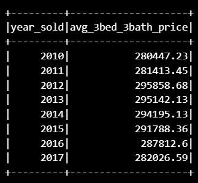

# Home_Sales

In this challenge,used SparkSQL to determine key metrics about home sales data.Also created temporary views, partition the data, cache and uncache a temporary table, and verified that the table has been uncached.

* As the first step,imported all dependancies and created a Spark session.
*  Read the provided data into a DataFrame.
* Created a temporary view of the DataFrame as 'home_sales'.
* Answered the following quwstions:

* What is the average price for a four bedroom house sold per year, rounded to two decimal places?

* What is the average price of a home for each year the home was built,that have 3 bedrooms and 3 bathrooms, rounded to two decimal places?

* What is the average price of a home for each year the home was built,that have 3 bedrooms, 3 bathrooms, with two floors,and are greater than or equal to 2,000 square feet, rounded to two decimal places?

* What is the average price of a home per "view" rating, rounded to two decimal places,having an average home price greater than or equal to $350,000? Order by descending view rating.Although this is a small dataset, determine the run time for this query.

* Cached the temporary table 'home_sales' and run the above query to find the difference in the excecution time.The excecution time before caching was 1.344 seconds whereas after cashing was 0.605 seconds.

* Next, partitioned by the "date_built" field on the formatted parquet 'home sales' data.

* Created a temporary table for the parquet data.

* Using the parquet DataFrame, run the last query above,and found the run time.That was 1.539 seconds.

* Finally uncached the 'home_sales' temporary table.